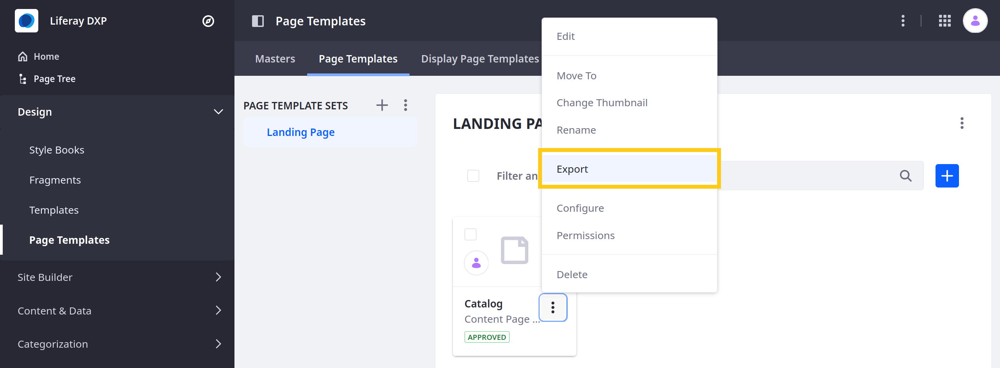
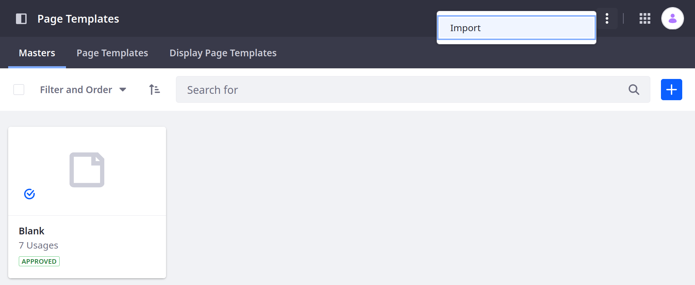
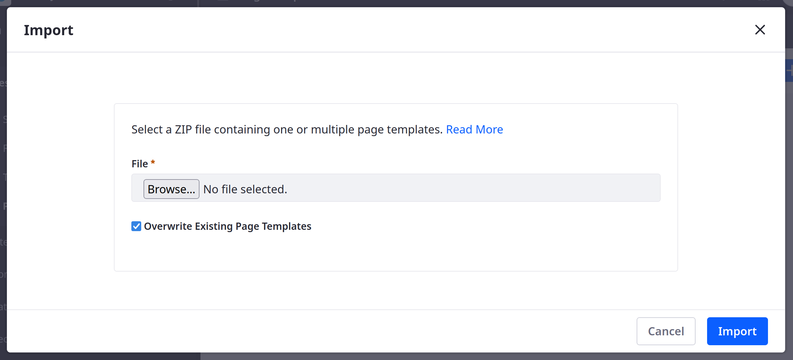

# Exporting and Importing Page Templates

Sometimes it's easier to edit templates in a code editor. Once you've [created a Page Template](./creating-a-page-template.md), you can [export](../../building-sites/importing-exporting-pages-and-content.md) it, edit it locally in the editor of your choice, and then import the template back into Liferay. You can import the template into any Site on the system.

For more general information about the Export/Import Framework, see [Importing/ Exporting Sites and Content](../../building-sites/importing-exporting-pages-and-content.md).

```{note}
For Liferay DXP 7.4+, Page Template Collections are called Page Template Sets in the Liferay UI.
```

## Exporting a Page Template

Follow these steps to export a Page Template:

1. Open the *Site Menu* () and go to *Design* &rarr; *Page Templates*.

1. Click the *Page Templates* tab.

1. Select the Page Template Set that contains the desired template.

1. Click the *Actions* button () for the desired Page Template and select *Export*.

   

1. Click *OK* in the confirmation window.

The Page Template downloads as a ZIP file to your local machine.

```{tip}
You can export more than one Content Template at once. However, you cannot include Widget Templates with Content Pages in the same ZIP file.
```

The last published version of the Page Template is always exported. If the Page Template has never been published, it cannot be exported.

The exported ZIP file contains these files:

* `page-template-collection.json`: Includes the name of the Set where the Page Template is saved and any other metadata
* An optional thumbnail file
* `page-template.json`: Contains the Page Template name and any other metadata
* `page-definition.json`: specifies the structure and content of the Page Template.

The ZIP file may contain different types of page templates as well, like `display-page-template.json`, `master-page.json`, `page-template-collection.json` and `page-template.json`.

## Importing a Page Template

Follow these steps to import a Page Template:

1. Open the *Site Menu* () and go to *Design* &rarr; *Page Templates*.

1. Click the *Actions* button () in the Application Bar and select *Import*.

   

1. Select the desired Page Template file.

1. Click *Import*.

   

1. Close the *Import* window.

The Page Template has been imported into the Site.

## Additional Information

* [Creating a Page Template](./creating-a-page-template.md)
* [Importing/ Exporting Sites and Content](../../building-sites/importing-exporting-pages-and-content.md)
* [Creating Collections](../../../content-authoring-and-management/collections-and-collection-pages/creating-collections.md)
